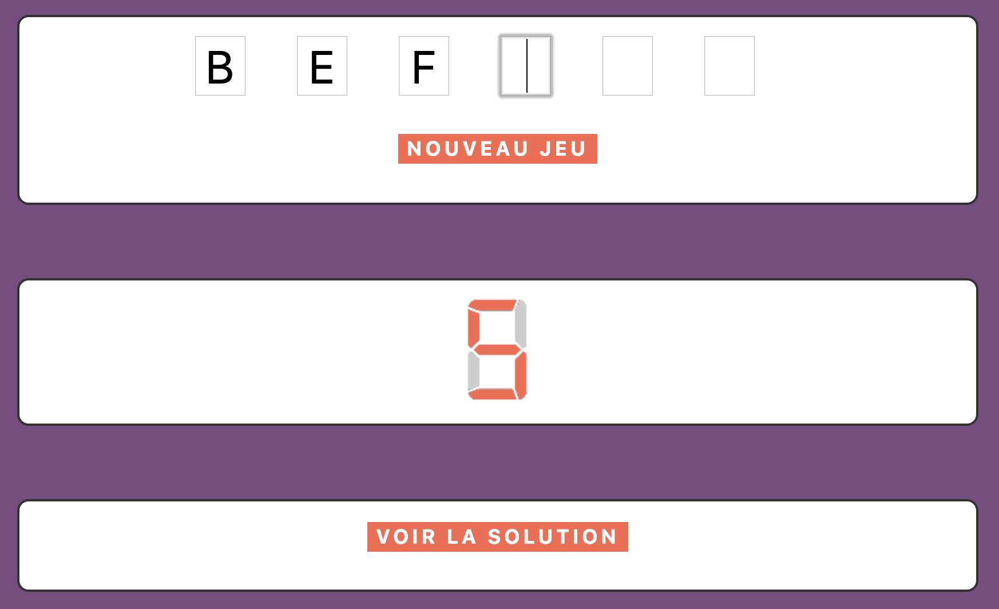
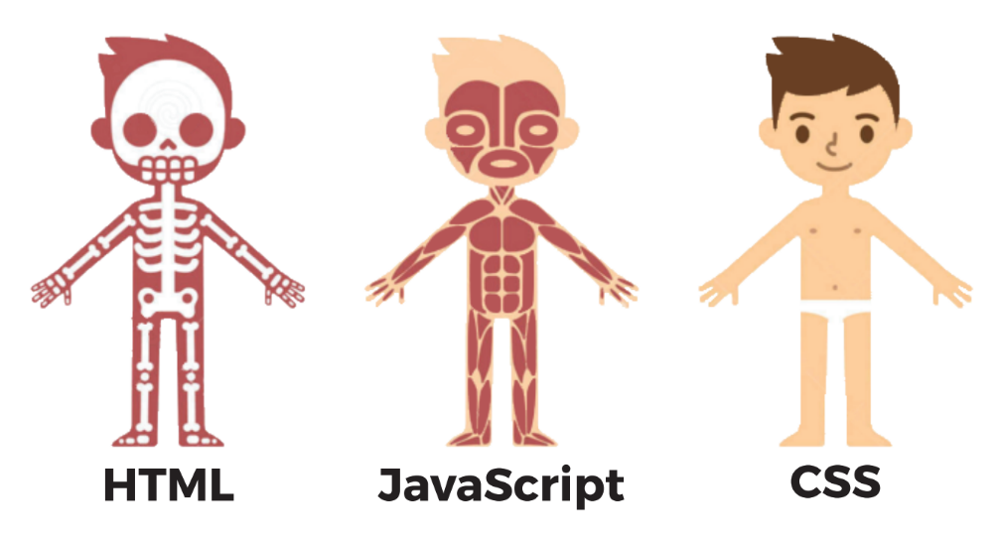

# Atelier jeu web par le Garage
Le Garage vous propose, pour cet atelier de découverte du web, de développer un jeu web. 

Le principe est simple : découvrir toutes les lettres d'un mot mystère en faisant moins de 7 erreurs.

Ce Projet a pour but de vous initier au développement web avec du code HTML/CSS/JS.

C'est du code client, c'est à dire des langages interprétés par votre navigateur pour afficher une page web.

Pourquoi faire la différence entre front et back end ?
Cela vient de l'architecture client/serveur, sur laquelle repose le web

Il y a donc des langages côté client et côté serveur.

## Déroulement du TP
Chaque langage a son utilité pour le projet :

Nous allons manipuler ces langages à travers les différentes étapes du projet, en partant du HTML, en passant par le CSS et en terminant avec le JS.

Chaque branche du projet représente l'une de ces étapes pour le développement du jeu du Pendu :
* [Découverte du HTML](https://github.com/JaminNormand/pendu-le-garage/tree/step-1)
* [Première page HTML](https://github.com/JaminNormand/pendu-le-garage/tree/step-2)
* [Découverte du CSS](https://github.com/JaminNormand/pendu-le-garage/tree/step-3)
* [Une feuille de style complète](https://github.com/JaminNormand/pendu-le-garage/tree/step-4)
* [Découverte du JavaScript](https://github.com/JaminNormand/pendu-le-garage/tree/step-5)
* [Premier code JavaScript](https://github.com/JaminNormand/pendu-le-garage/tree/step-6)
